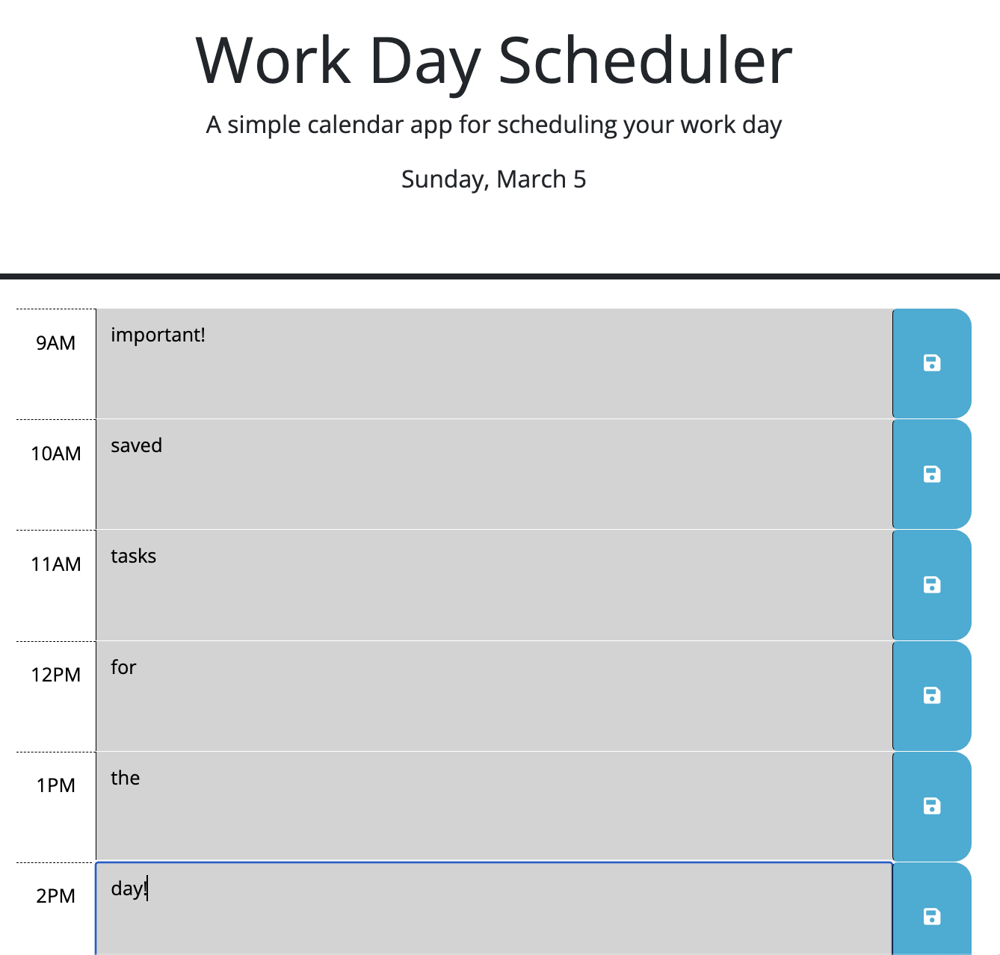

# Work Day Scheduler

## Description
This daily scheduler allows users to plan out there day by saving tasks each hour. You'll always know the current hour based on the colors which show current time (red), past time (grey) and future time (green). Even if the browser is closed/refreshed your tasks will stay put! 

## Table of Contents
- [Usage](#usage)
- [Credits](#credits)
- [Features](#features)
- [Access](#access)

## Usage
- Populate the hour with desired text
- Press 'Save' icon
- Come back to the page at any time and your work will be saved

## Credits
Pulled source code from [here](https://github.com/coding-boot-camp/crispy-octo-meme), as well as used examples from various Third-Party API trainings.

## Features
- The color coding makes it easy to know which hour you are in
- Saving the tasks keep memory of what you've planned even if the browser closes

## Access
Click to view: [Work Day Scheduler](https://johnpow.github.io/work-day-scheduler/).